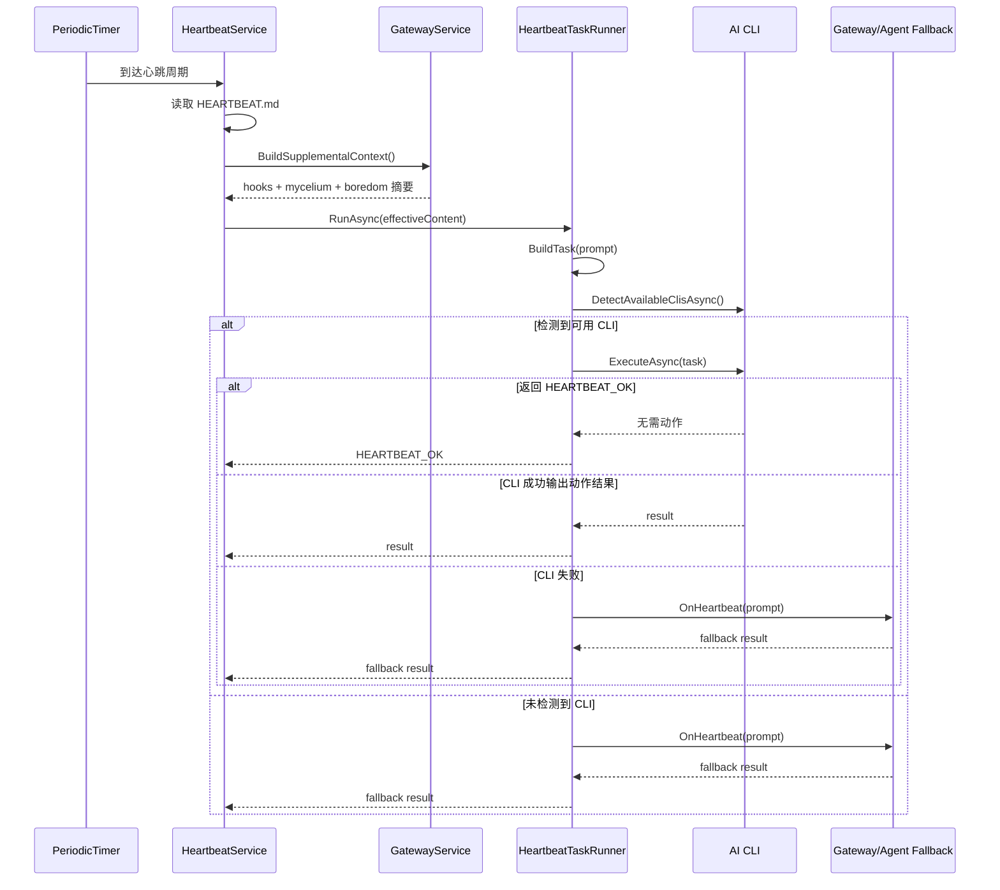
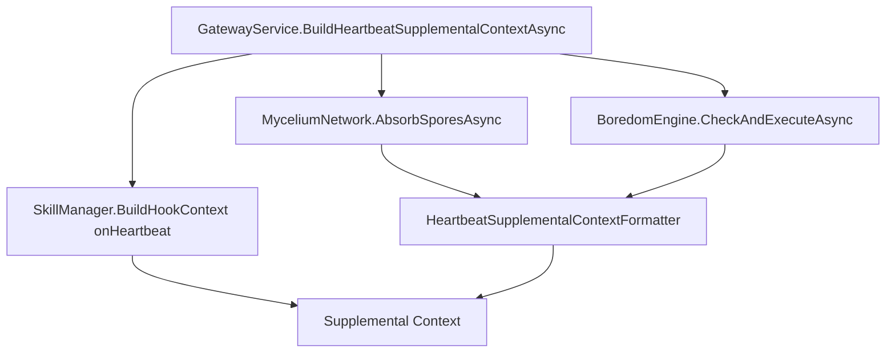

# MyClaw.NET Heartbeat 编排与自主执行

> 更新日期: 2026-03-31
> 文档目标: 解释 Heartbeat 这一条运行时主路径现在如何被触发、如何组装补充上下文、如何优先走 AI CLI 自主执行，以及何时回退到 Agent。
> 当前事实口径: 若与历史文档冲突，以根目录的 TODO.md、docs/主路径与模块编排.md 和当前源码为准。

---

## 这份文档回答什么

Heartbeat 在这个仓库里已经不是“定时读一个文件然后调用 Agent”这么简单。它现在负责四件事：

1. 周期性读取 `HEARTBEAT.md`。
2. 在执行前拼接运行时补充上下文。
3. 优先尝试本机可用的 AI CLI 自主执行。
4. 当自主执行不可用或失败时，回退到 Gateway 中的 Agent 主路径。

如果你要判断“这条链路现在是否真实在线”，这份文档就是入口。

---

## 入口与关键文件

| 组件 | 作用 | 关键文件 |
|:-----|:-----|:---------|
| `HeartbeatService` | 定时触发、读取 `HEARTBEAT.md`、合并补充上下文、驱动 runner | [../src/MyClaw.Heartbeat/HeartbeatService.cs](../src/MyClaw.Heartbeat/HeartbeatService.cs) |
| `HeartbeatTaskRunner` | 优先走 AI CLI，自主执行失败时回退到 `OnHeartbeat` | [../src/MyClaw.Heartbeat/HeartbeatTaskRunner.cs](../src/MyClaw.Heartbeat/HeartbeatTaskRunner.cs) |
| `AiCliDetector` | 检测 `claude` / `gemini` / `kimi` / `aider` 等 CLI 是否可用 | [../src/MyClaw.Heartbeat/AiCliDetector.cs](../src/MyClaw.Heartbeat/AiCliDetector.cs) |
| `AutonomousExecutor` | 真正调用 CLI，处理 `HEARTBEAT_OK` 与超时 | [../src/MyClaw.Heartbeat/AutonomousExecutor.cs](../src/MyClaw.Heartbeat/AutonomousExecutor.cs) |
| `GatewayService` | 为 Heartbeat 注入 fallback handler 和 supplemental context builder | [../src/MyClaw.Gateway/GatewayService.cs](../src/MyClaw.Gateway/GatewayService.cs) |
| `HeartbeatSupplementalContextFormatter` | 将菌丝吸收与无聊扫描压缩成低噪音摘要 | [../src/MyClaw.Gateway/HeartbeatSupplementalContextFormatter.cs](../src/MyClaw.Gateway/HeartbeatSupplementalContextFormatter.cs) |

---

## 运行顺序

---

## 详细链路拆解

### 1. 调度与基础门禁

`HeartbeatService` 默认以 30 分钟为间隔运行一个 `PeriodicTimer`。每次触发时，不会无条件执行，而是先检查两类工作源：

- `HEARTBEAT.md` 自身是否包含真实任务项。
- `BuildSupplementalContext` 是否返回了可执行的运行时补充上下文。

当前门禁逻辑的关键点：

- 如果 `HEARTBEAT.md` 只是模板壳子，没有实际任务项，而补充上下文也为空，则这一轮直接跳过。
- 如果 `HEARTBEAT.md` 没有任务，但补充上下文存在，Heartbeat 仍然会触发执行。

这意味着 Heartbeat 不再被单一文件内容硬绑定，而是已经具备“运行时上下文驱动”的能力。

### 2. 补充上下文的来源

Heartbeat 的补充上下文目前由 Gateway 负责组装，入口在 `GatewayService.BuildHeartbeatSupplementalContextAsync()`。

当前会被纳入的三类信息：

1. `onHeartbeat` skill hooks
2. `MyceliumNetwork.AbsorbSporesAsync()` 的吸收结果
3. `BoredomEngine.CheckAndExecuteAsync()` 的扫描结果

格式化规则在 `HeartbeatSupplementalContextFormatter` 中：

- 默认输出低噪音摘要，只保留数量、主文件、首个待办等高信号信息。
- 仅在 verbose 模式下展开详情，例如全部 TODO 列表或孢子来源。

这是 Heartbeat 当前“既接线又控噪”的关键设计点。

### 3. Task 组装方式

`HeartbeatTaskRunner` 不直接接收原始 Markdown，而是先通过 `BuildTask()` 组装为统一提示词。提示词会附带一条明确约束：

- 如果没有任何事情需要处理，必须精确返回 `HEARTBEAT_OK`

这个约束使得执行结果可以被简单、稳定地归类为：

- 无动作
- 有动作输出
- 执行失败并需 fallback

### 4. AI CLI 检测与自主执行

`AiCliDetector` 当前会按顺序检测这些可执行工具：

- `claude`
- `gemini`
- `kimi`
- `aider`

检测方式是运行对应的 `--version` 命令；一旦检测成功，runner 会优先使用找到的第一个 CLI 作为自主执行后端。

`AutonomousExecutor` 的关键约束：

- 通过标准输入传入 prompt
- 默认 5 分钟超时
- 返回 `HEARTBEAT_OK` 则视为无动作成功
- 非 0 退出码则视为失败，进入 fallback 路径

当前实现的取舍很明确：先求稳定的最小自主执行闭环，而不是为不同 CLI 写大量分支参数适配。

### 5. Fallback 到 Gateway/Agent

如果当前机器没有可用 AI CLI，或者有 CLI 但这次执行失败，`HeartbeatTaskRunner` 会调用 `OnHeartbeat`。

在运行时里，这个回调通常由 `GatewayService.ExecuteHeartbeatAsync()` 提供，最终回到 Agent 主路径：

1. Gateway 接收到 Heartbeat prompt
2. 调用 `ProcessMessageAsync(prompt, "heartbeat")`
3. 由 `MyClawAgent` 或 `FallbackAgent` 执行模型调用

因此 Heartbeat 与 Agent 并不是两套平行系统，而是一条优先走自主执行、失败时回到统一 prompt 主路径的链路。

---

## 补充上下文内部结构

### `onHeartbeat` hooks

这部分允许 skills 在每轮心跳前注入运行时提醒或规则。它适合放：

- 定期检查约束
- 周期性巡检建议
- 需要在后台时也保留的工作流提醒

### 菌丝吸收摘要

Heartbeat 会主动消费来自其他实例的孢子，并把吸收结果压成一段 `## MYCELIUM` 摘要。默认摘要中只保留：

- 吸收数量
- 痛觉记忆数量
- 工具抗体数量

只有 verbose 模式才展示来源实例。

### 无聊扫描摘要

Heartbeat 还会调用 `BoredomEngine`。如果满足长时间无活动且不在冷却期，它会：

1. 随机扫描源文件
2. 提取 TODO / FIXME / HACK
3. 把发现写入 `HORIZONS.md`
4. 返回一个压缩后的 `## BOREDOM` 摘要

默认模式下不会把全部 TODO 都注入 prompt，而只给一个紧凑摘要和首条 lead item。

---

## 当前已验证的行为

Heartbeat 相关行为不是只靠口头约定，当前已经有几组测试覆盖：

### 1. Runner 的三种结果分支

测试文件：

- [../tests/MyClaw.Integration.Tests/Heartbeat/HeartbeatServiceTests.cs](../tests/MyClaw.Integration.Tests/Heartbeat/HeartbeatServiceTests.cs)

已覆盖：

- 无可用 CLI 时使用 fallback handler
- CLI 返回 `HEARTBEAT_OK` 时直接判定为无动作
- CLI 执行失败时回退到 fallback handler

### 2. Service 合并基础任务与补充上下文

同一测试文件还覆盖：

- `HEARTBEAT.md` 与 supplemental context 的合并
- 即使基础任务为空，只要 supplemental context 存在，仍然触发 runner

### 3. Formatter 的低噪音 / verbose 双模式

测试文件：

- [../tests/MyClaw.Integration.Tests/Gateway/HeartbeatSupplementalContextFormatterTests.cs](../tests/MyClaw.Integration.Tests/Gateway/HeartbeatSupplementalContextFormatterTests.cs)

已覆盖：

- 无聊摘要在默认模式下只输出压缩结果
- verbose 模式下输出完整 todo 列表
- 菌丝摘要默认只展示计数，不展示来源

### 4. 无聊引擎和菌丝网络本身的核心行为

测试文件：

- [../tests/MyClaw.Core.Tests/Curiosity/BoredomEngineTests.cs](../tests/MyClaw.Core.Tests/Curiosity/BoredomEngineTests.cs)
- [../tests/MyClaw.Core.Tests/Mycelium/MyceliumNetworkTests.cs](../tests/MyClaw.Core.Tests/Mycelium/MyceliumNetworkTests.cs)

已覆盖：

- 无聊引擎的扫描、写入 `HORIZONS.md` 与冷却逻辑
- 菌丝孢子的分泌、异体吸收与 `.consumed` 标记

---

## 当前边界与限制

### 1. CLI 选择策略仍然是“找到第一个就用”

当前实现没有做更复杂的 CLI 评分，也没有根据任务类型切换不同 CLI。其好处是简单、稳定，代价是策略还比较朴素。

### 2. CLI 参数适配目前保持最小实现

`AutonomousExecutor.GetRunArguments()` 目前默认返回空字符串，等价于“尽量假设 CLI 能从 stdin 读取 prompt”。这条路径已经足够打通主流程，但若未来需要适配更具体的 CLI 参数契约，应在这里收口，而不是把分支散到 service 层。

### 3. Heartbeat 目前没有独立的 feature flag 文档化入口

当前链路可用，但“哪些 supplemental sources 在哪些部署场景下应开或关”还没有独立的配置文档。这是后续细化文档时可以补的专题，而不是当前主路径的阻塞项。

---

## 何时改这条链路

以下改动属于 Heartbeat 文档必须同步更新的范围：

- 新增或删除 supplemental context 来源
- 更改 AI CLI 选择策略
- 更改 `HEARTBEAT_OK` 协议
- 更改 fallback 行为或入口
- 更改默认噪音控制策略

如果只是调整某个内部模块的实现细节，但不改变这条链路的外部行为，这份文档不必跟着微调。

---

## 相关文档

建议按这个顺序阅读：

1. [主路径与模块编排.md](./主路径与模块编排.md)
2. 本文档
3. [../TODO.md](../TODO.md)
4. 若要追溯背景，再看 [MiniClaw-vs-myclaw.net-v2.md](./MiniClaw-vs-myclaw.net-v2.md)
