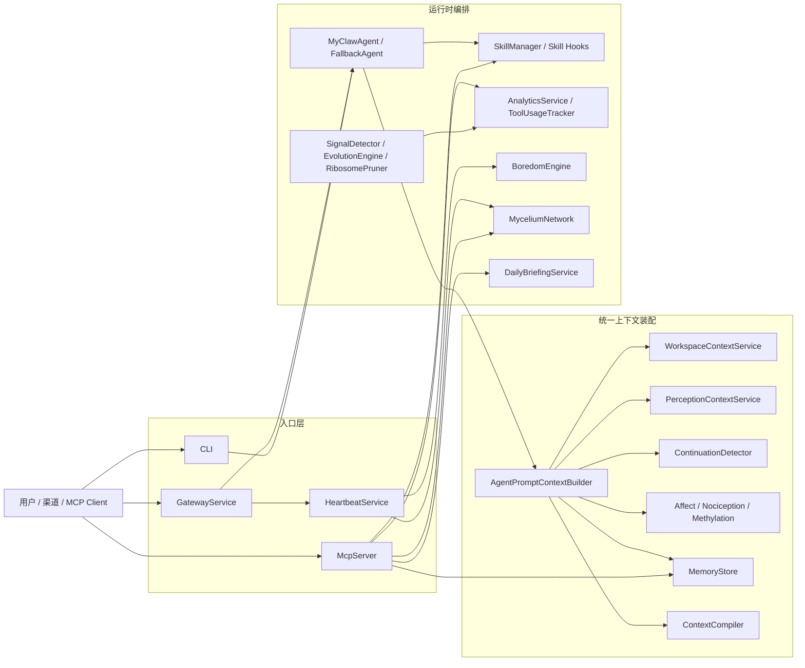
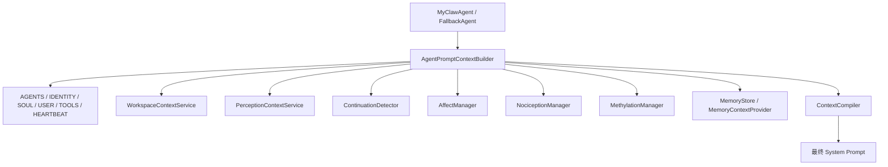

# MyClaw.NET 主路径与模块编排

> 更新日期: 2026-03-31
> 文档目标: 用一份文档说明当前已经在线的主路径、关键模块关系和运行时编排，而不是重复写新的计划文档。
> 当前事实口径: 若与历史文档冲突，以根目录的 TODO.md 和 改进方案和计划.md 为准。

---

## 为什么先看这份

当前仓库的主要问题已经不再是“模块太少”，而是“模块很多，但如果没有一张当前主路径图，就很难快速判断哪些能力已经真实接线”。

这份文档只描述三类内容：

1. 当前在线的三条主路径。
2. 这些主路径之间共享的核心服务。
3. 仍然保留的边界和待外部验证项。

它不重复讲历史方案，也不替代长篇教程。

---

## 一图总览

---

## 当前在线的三条主路径

### 1. Agent 交互主路径

这条链路负责“用户提问 -> 装配系统提示词 -> 调模型 -> 使用技能与记忆工具”。

主入口文件：

- [../src/MyClaw.Agent/MyClawAgent.cs](../src/MyClaw.Agent/MyClawAgent.cs)
- [../src/MyClaw.Agent/AutoModelProvider.cs](../src/MyClaw.Agent/AutoModelProvider.cs)
- [../src/MyClaw.Agent/AgentPromptContextBuilder.cs](../src/MyClaw.Agent/AgentPromptContextBuilder.cs)

当前真实流程：

1. `MyClawAgent` 或 `FallbackAgent` 创建模型实例，并委托 `AgentPromptContextBuilder` 装配系统提示词。
2. `AgentPromptContextBuilder` 收集 DNA 文件、工作区、平台感知、时间模式、续聊摘要、情感、痛觉、甲基化和记忆上下文。
3. `ContextCompiler` 对这些段落按优先级和 token 预算做编译，超预算时优先保留 frontmatter、标题和尾部上下文。
4. `SkillManager` 提供已加载 skills，并把 `onBoot` hooks 注入系统提示词。
5. `MemoryTool` 与 skill hooks 形成回流，写记忆后可立即把 `onMemoryWrite` 上下文拼回结果。

这一条链路的关键变化是：系统提示词不再由多个调用点手工拼接，而是收口到一个装配器。

### 2. Heartbeat 自主执行主路径

这条链路负责“定时心跳 -> 生成附加上下文 -> 优先尝试 AI CLI 自主执行 -> 无法自主执行时回退给 Agent”。

主入口文件：

- [../src/MyClaw.Heartbeat/HeartbeatService.cs](../src/MyClaw.Heartbeat/HeartbeatService.cs)
- [../src/MyClaw.Heartbeat/HeartbeatTaskRunner.cs](../src/MyClaw.Heartbeat/HeartbeatTaskRunner.cs)
- [../src/MyClaw.Gateway/GatewayService.cs](../src/MyClaw.Gateway/GatewayService.cs)
- [../src/MyClaw.Gateway/HeartbeatSupplementalContextFormatter.cs](../src/MyClaw.Gateway/HeartbeatSupplementalContextFormatter.cs)

当前真实流程：

1. `HeartbeatService` 定时读取 `HEARTBEAT.md`。
2. 若 Gateway 已接入 supplemental context builder，则在每次心跳前生成附加上下文。
3. 这份附加上下文目前由三部分组成：
   - `onHeartbeat` skill hooks
   - `MyceliumNetwork.AbsorbSporesAsync()` 的吸收摘要
   - `BoredomEngine.CheckAndExecuteAsync()` 的低噪音扫描摘要
4. `HeartbeatTaskRunner` 优先检测可用 AI CLI 并尝试自主执行。
5. 如果没有可用 CLI 或执行失败，则通过 `OnHeartbeat` 回退到 Gateway 中的 Agent 主路径。

这条链路意味着：无聊扫描、菌丝吸收和 hooks 已经不是“有模块没入口”，而是会在心跳周期里真正参与行为。

如果要看这条链路的更细分解，可直接继续读 [Heartbeat编排与自主执行.md](./Heartbeat编排与自主执行.md)。

### 3. MCP 工具主路径

这条链路负责“stdio MCP 请求 -> 调用工具 -> 回写记忆 / DNA / skills / 统计 / briefing”。

主入口文件：

- [../src/MyClaw.MCP/McpServer.cs](../src/MyClaw.MCP/McpServer.cs)
- [../src/MyClaw.Core/Ribosome/RibosomeLoader.cs](../src/MyClaw.Core/Ribosome/RibosomeLoader.cs)
- [../templates/RIBOSOME.json](../templates/RIBOSOME.json)

当前真实流程：

1. `McpServer` 在启动时加载 `MemoryStore`、`EntityStore`、`SkillManager`、`AnalyticsService`、`ToolUsageTracker`、`DailyBriefingService` 与 `MyceliumNetwork`。
2. `RibosomeLoader` 和模板 `RIBOSOME.json` 共同定义默认工具 schema。
3. 运行中的 MCP 工具至少覆盖以下主路径能力：
   - `myclaw_update`: DNA 安全写入，含 `TelomereGuard` 和 `PurposeMap`
   - `myclaw_skill`: create/list/delete/harvest，含 Substrate Harvesting
   - `myclaw_mutate`: 受限重写 `SOUL.md` / `IDENTITY.md`
   - `myclaw_reproduce`: 导出 `.spore.zip`
   - `myclaw_note` / `myclaw_entity` / `myclaw_briefing` / `myclaw_dream`
4. `TOOLS.md` 与 `NOCICEPTION.md` 的更新会触发 `MyceliumNetwork` 分泌路径。
5. `onFileChanged` 与 `onMemoryWrite` hooks 会在 MCP 结果上形成即时回传。

这一条链路是当前最完整、最容易被外部客户端直接感知的能力面。

---

## Prompt 装配链路

这一段是当前“统一主路径”的核心。只要未来继续补上下文能力，优先接到这条链上，而不是回到各个入口里手工拼接。

---

## 关键模块职责表

| 模块 | 当前职责 | 关键文件 |
|:-----|:---------|:---------|
| `MyClaw.Agent` | 模型调用、统一 prompt 装配、记忆工具注入、fallback provider | [../src/MyClaw.Agent/AgentPromptContextBuilder.cs](../src/MyClaw.Agent/AgentPromptContextBuilder.cs) |
| `MyClaw.Gateway` | 渠道编排、Cron、Heartbeat 编排、运行时补充上下文 | [../src/MyClaw.Gateway/GatewayService.cs](../src/MyClaw.Gateway/GatewayService.cs) |
| `MyClaw.Heartbeat` | 定时任务执行、自主执行优先、Agent fallback | [../src/MyClaw.Heartbeat/HeartbeatService.cs](../src/MyClaw.Heartbeat/HeartbeatService.cs) |
| `MyClaw.MCP` | 对外工具入口、DNA/skills/记忆/briefing 主路径 | [../src/MyClaw.MCP/McpServer.cs](../src/MyClaw.MCP/McpServer.cs) |
| `MyClaw.Skills` | `skills/<name>/SKILL.md` 加载、hooks、Harvesting、skill 文档生成 | [../src/MyClaw.Skills/SkillManager.cs](../src/MyClaw.Skills/SkillManager.cs) |
| `MyClaw.Core.Ace` | 上下文段落建模、预算编译、结构化骨架化 | [../src/MyClaw.Core/Ace/ContextCompiler.cs](../src/MyClaw.Core/Ace/ContextCompiler.cs) |
| `MyClaw.Core.Perception` | 平台感知抽象、provider、上下文接线 | [../src/MyClaw.Core/Perception/PerceptionContextService.cs](../src/MyClaw.Core/Perception/PerceptionContextService.cs) |
| `MyClaw.Core.Curiosity` | 无聊扫描、好奇心相关能力 | [../src/MyClaw.Core/Curiosity/BoredomEngine.cs](../src/MyClaw.Core/Curiosity/BoredomEngine.cs) |
| `MyClaw.Core.Mycelium` | 跨实例孢子分泌与吸收 | [../src/MyClaw.Core/Mycelium](../src/MyClaw.Core/Mycelium) |
| `MyClaw.Core.Evolution` | 模式检测、进化、甲基化、器官退化输入 | [../src/MyClaw.Core/Evolution/EvolutionEngine.cs](../src/MyClaw.Core/Evolution/EvolutionEngine.cs) |

---

## 当前已经闭环的编排点

以下能力已经不是“模块存在”，而是“用户主流程能感知到”：

- Agent / FallbackAgent 共用统一 prompt 装配。
- `ContextCompiler` 已进入主路径，并支持 skeletonization。
- Skills 已统一到 `skills/<name>/SKILL.md`，并支持四类 hooks。
- Heartbeat 已接入菌丝吸收、无聊扫描与 heartbeat hooks。
- MCP 已接入 mutate、reproduce、harvest、briefing、dream。
- Windows 平台感知已接入 prompt 主路径，并能影响 ACE 优先级。

---

## 当前仍需注意的边界

### 1. macOS 感知还缺宿主实机验证

代码层面已经有多探针 provider，但 TODO 中仍把“macOS 原生感知信号稳定可用”保留为待验证项。也就是说：

- 代码已接线
- 单测已覆盖解析与降级路径
- 但真实宿主表现还没有被本仓库当前状态正式确认

### 2. 文档扩张仍以“单一事实口径”为前提

当前不应该再新增平行计划文档。文档维护顺序应保持为：

1. 先更新根目录的 `TODO.md`
2. 再更新 `改进方案和计划.md`
3. 最后同步 `DOCUMENTS-INDEX.md` 和相关导读入口

### 3. 这份文档描述的是“当前在线主路径”，不是“所有可能模块”

如果某个模块没有进入这三条主路径，即便代码存在，也不应在这里被写成已经在线的能力。

---

## 建议阅读顺序

如果你是第一次进入这个仓库，建议按下面顺序看：

1. [../README.md](../README.md)
2. [../TODO.md](../TODO.md)
3. 本文档
4. [../改进方案和计划.md](../改进方案和计划.md)
5. 需要追历史时再看 [../实施总结报告.md](../实施总结报告.md) 或 [MiniClaw-vs-myclaw.net-v2.md](./MiniClaw-vs-myclaw.net-v2.md)

---

## 维护约束

- 不再新增平行“路线图 / 改进清单 / 执行摘要”文档。
- 架构变化若影响主路径，应优先更新本文档。
- 文中只记录已经接线的事实，不提前写未来状态。
